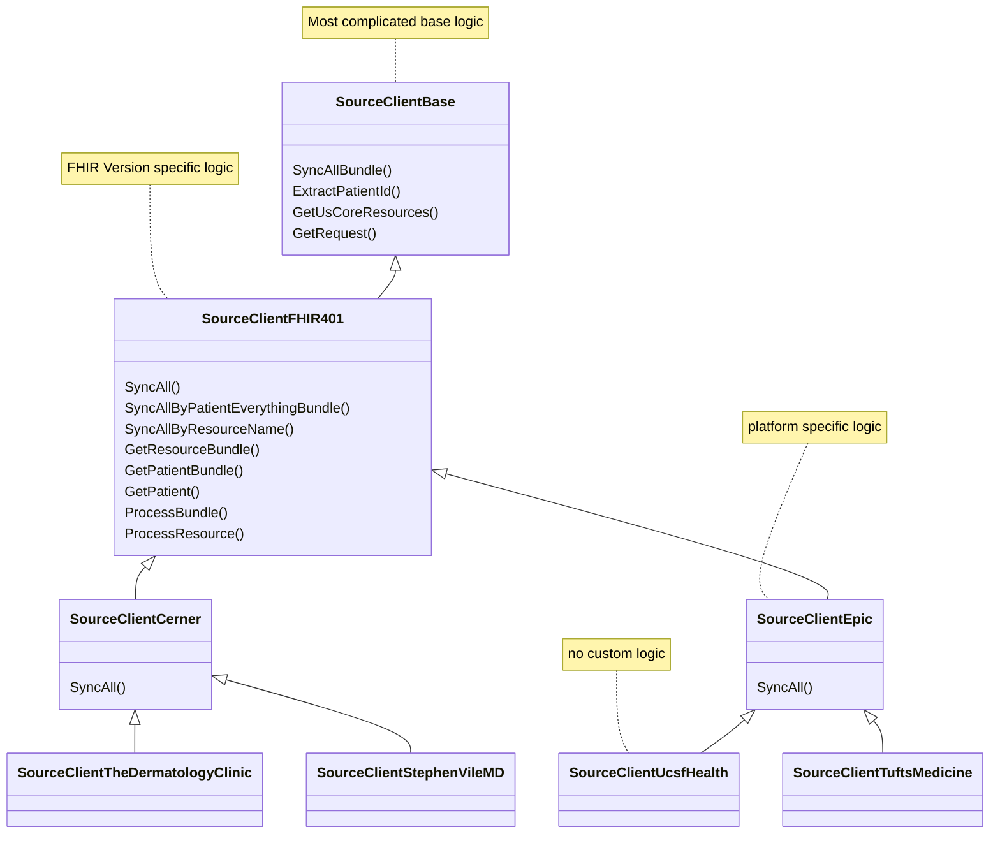

> This doc is a WIP and will be expanded shortly.
>
> In the meantime, please consider looking at the extensive docs in the [Fasten Docs Repository](https://github.com/fastenhealth/docs/tree/main/technical)


The Fasten Sources is a library that defines medical provider metadata (`definitions` - OpenID Metadata documents)
and http clients (OAuth2/Smart-on-FHIR clients) which can be used to retrieve data from various Medical
Providers (`clients`).

Development in this repositry is complicated for a couple of reasons:

- writing a new OAuth client requires a client application registration  & `client-id` (and sometimes a `client-secret`). 
- most files in this repository are generated classes - created via automation in `fasten-sources-gen`

However, it is still possible to develop & test OAuth2 clients.

> In general, Fasten Sources follow an inheritance model. Base and FHIR version specific classes/structs
> define most complicated logic, while Platform logic is mostly related to required Headers or API overrides
>
> Institution Sources should have no custom logic at all, as they are running a supported Platform, with a custom domain.



# Setup Testing Environment

```
git clone https://github.com/fastenhealth/fasten-sources.git
cd fasten-sources
go mod tidy
go mod vendor
go test ./...
```


## Writing Tests or Creating Recordings for Existing Client


If we're testing or making changes to an existing client, we can do the following:

1. Determine the Platform source we'd like to modify (Institution sources are sparse and contain no custom logic).
2. Open browser tool to which will allow us to generate a access-token for our source. 
```bash

make serve-backend

# this should start a simple webserver and open a browser to http://localhost:9999
```

3. Select "Sandbox" radio button
4. Select Platform you'd like to generate an Access Token for. 
5. Login with Sandbox credentials for the platform - https://github.com/fastenhealth/docs/blob/main/BETA.md#sandbox-flavor
6. Continue through all prompts, until redirected back to Fasten Lighthouse and localhost. 
7. Wait for OAuth handshake to complete, note **Access Token** and **Patient ID**. 
8. Find the [test file](./clients/internal/platform) for the source you'd like to change. 
9. Create a new test function. **Make sure to specify Patient ID and Access Token you noted earlier**

> Make sure `fakeSourceCredential.EXPECT().GetPatientId().AnyTimes().Return(<<PATIENT_ID>>)` is populated
>
> Make sure `httpClient := base.OAuthVcrSetup(t, true, <<ACCESS_TOKEN>>)` is populated, and 2nd parameter is `true`

```go

func TestGetSourceClientCerner_SyncAll(t *testing.T) {
	t.Parallel()
	//setup
	testLogger := logrus.WithFields(logrus.Fields{
		"type": "test",
	})
	mockCtrl := gomock.NewController(t)
	defer mockCtrl.Finish()
	fakeDatabase := mock_models.NewMockDatabaseRepository(mockCtrl)
	fakeDatabase.EXPECT().UpsertRawResource(gomock.Any(), gomock.Any(), gomock.Any()).Times(694).Return(true, nil)

	fakeSourceCredential := mock_models.NewMockSourceCredential(mockCtrl)
	fakeSourceCredential.EXPECT().GetPatientId().AnyTimes().Return(<<PATIENT_ID>>)
	fakeSourceCredential.EXPECT().GetSourceType().AnyTimes().Return(pkg.SourceTypeCerner)
	fakeSourceCredential.EXPECT().GetApiEndpointBaseUrl().AnyTimes().Return("https://fhir-myrecord.cerner.com/r4/ec2458f2-1e24-41c8-b71b-0e701af7583d")

	httpClient := base.OAuthVcrSetup(t, true, <<ACCESS_TOKEN>>)
	client, _, err := GetSourceClientCerner(pkg.FastenLighthouseEnvSandbox, context.Background(), testLogger, fakeSourceCredential, httpClient)

	//test
	resp, err := client.SyncAll(fakeDatabase)
	require.NoError(t, err)

	//assert
	require.NoError(t, err)
	require.Equal(t, 931, resp.TotalResources)
	require.Equal(t, 694, len(resp.UpdatedResources))
}
```

10. Run your new test (and generate a recording) by running the following command `go test ./...`
11. Disable recording mode
```go
httpClient := base.OAuthVcrSetup(t, true, <<ACCESS_TOKEN>>)

//should become
httpClient := base.OAuthVcrSetup(t, false)

```
12. Make sure your new recording is added to git
```bash
git add clients/internal/platform/testdata
```

13. Once you're satisfied with your changes to the Platform client, open a pull request. A maintainer will verify your changes & recordings, apply your changes to the `fasten-sources-gen` repository, regenerate the class and verify using your recordings. :partying_face:


---

## Notes

This library can take a long time to build, as there are thousand's of generated go files. 

https://github.com/golang/go/issues/45474
https://groups.google.com/g/golang-nuts/c/NJj9nP2Xc0I

```bash
go clean -cache
time go build ./...
# 129.83s user 5.78s system 204% cpu 1:06.23 total
```


# Docker

```bash

docker build . -t fasten_sources
docker run --rm -it -p 9999:9999 fasten_sources


```
