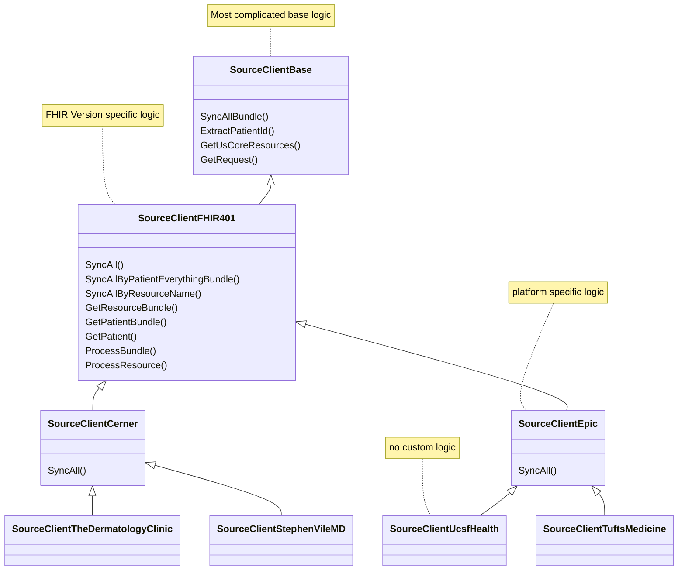

> This doc is a WIP and will be expanded shortly.
>
> In the meantime, please consider looking at the extensive docs in the [Fasten Docs Repository](https://github.com/fastenhealth/docs/tree/main/technical)


The Fasten Sources is a library that defines medical provider metadata (`definitions` - OpenID Metadata documents)
and http clients (OAuth2/Smart-on-FHIR clients) which can be used to retrieve data from various Medical
Providers (`clients`).

Development in this repositry is complicated for a couple of reasons:

- writing a new OAuth client requires a client application registration  & `client-id` (and sometimes a `client-secret`). 
- most files in this repository are generated classes - created via automation in `fasten-sources-gen`

However, it is still possible to develop & test OAuth2 clients.

> In general, Fasten Sources follow an inheritance model. Base and FHIR version specific classes/structs
> define most complicated logic, while Platform logic is mostly related to required Headers or API overrides
>
> Institution Sources should have no custom logic at all, as they are running a supported Platform, with a custom domain.




## Writing Tests or Creating Recordings for Existing Client


If we're testing or making changes to an existing client, we can do the following:

1. Generate an AccessToken for the Source/OAuth client you'd like to test
```bash

cd testutils
go run oauth_cli.go

```

2. select "Sandbox" or "Production" depending on which 


