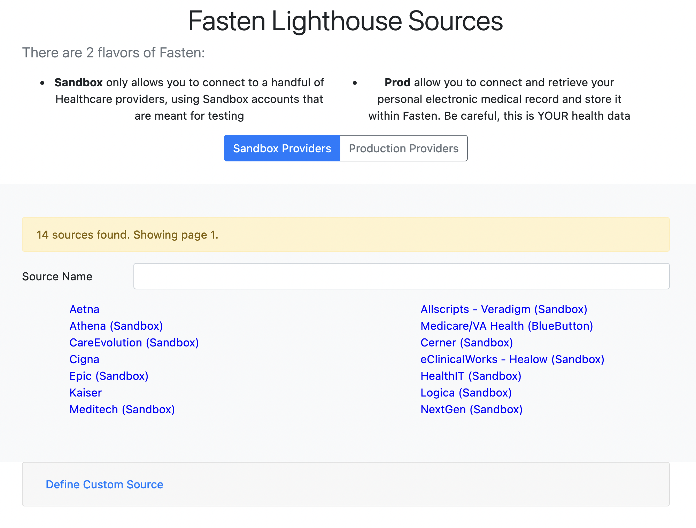
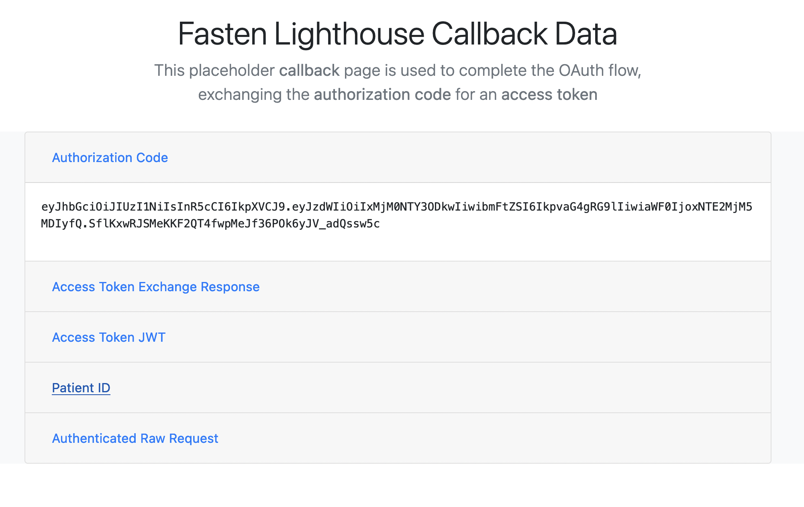
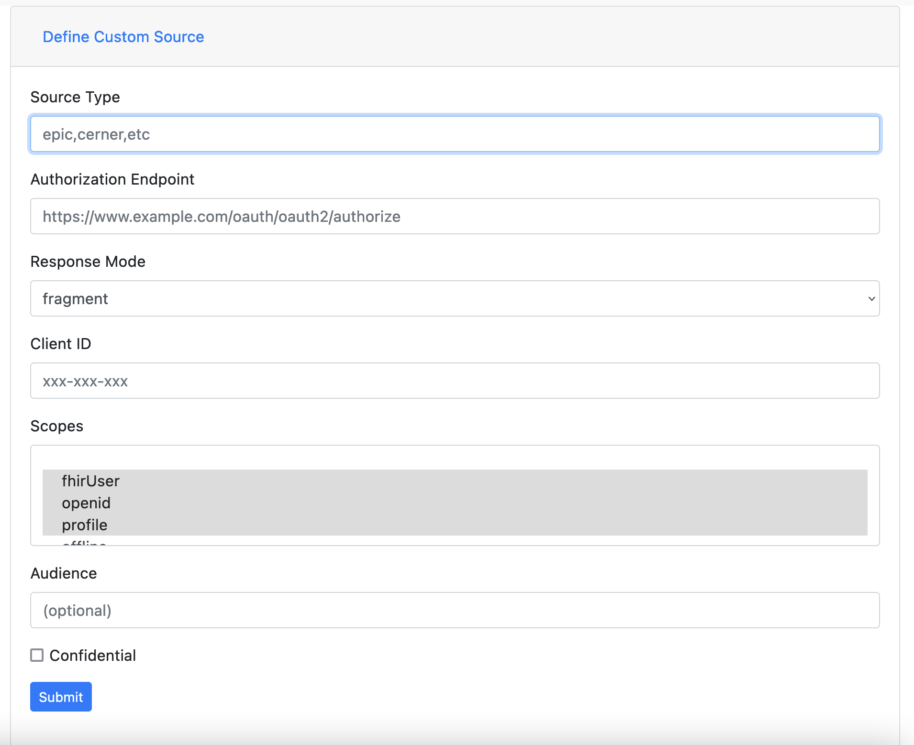
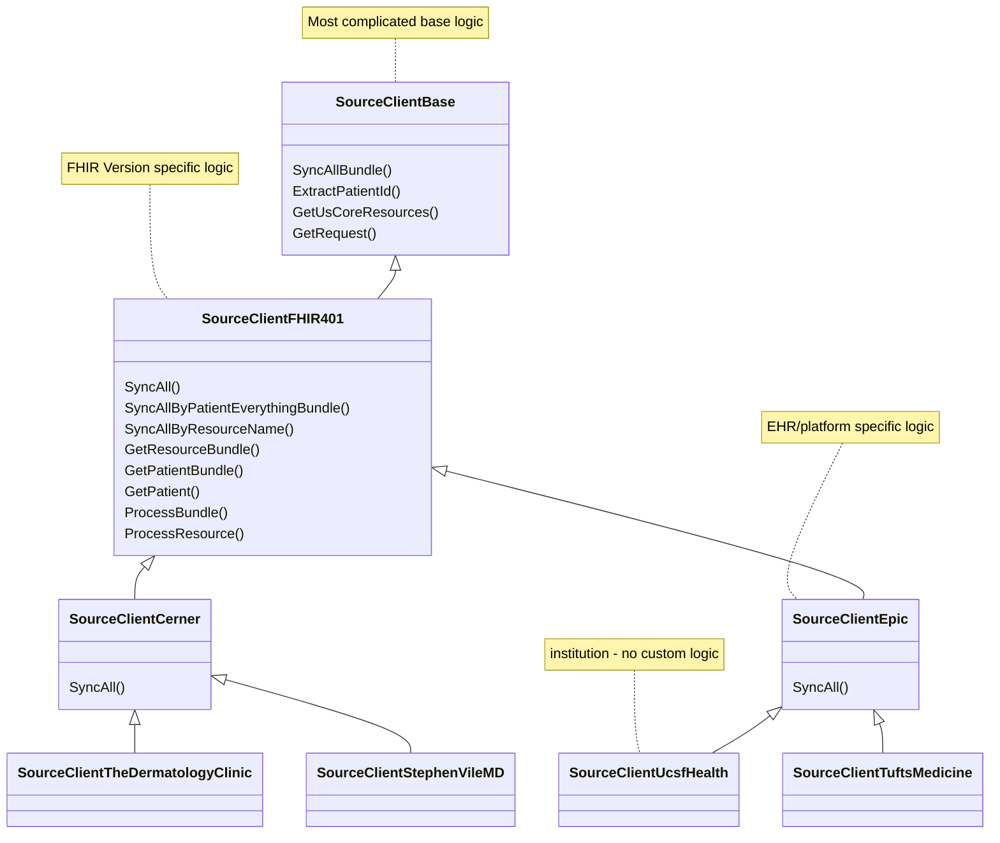

> This doc is a WIP and will be expanded shortly.
>
> In the meantime, please consider looking at the extensive docs in the [Fasten Docs Repository](https://github.com/fastenhealth/docs/tree/main/technical)


The Fasten Sources is a library that defines healthcare institution API metadata (`definitions` - OpenID Metadata documents)
and http clients (OAuth2/Smart-on-FHIR clients) which can be used to retrieve data from various healthcare institutions (`clients`).

> In general Healthcare Institutions don't develop their own API's, instead they run a supported EHR Platform (Epic, Cerner, etc) with a custom domain.
> This allows Fasten to write a single client for each Platform, and then use that client for all institutions running that Platform.

Development in this repository is complicated for a couple of reasons:

- writing a new OAuth client requires a client application registration  & `client-id` (and sometimes a `client-secret`). 
  - this registration can differ significantly between EHR systems. Some EHR's make the registration process easy, while others are incredibly convoluted.
  - as a developer intending to contribute your medical provider's OAuth2 client, you should document the registration process, and include it in your PR. 
- most files in this repository are generated classes - created via automation in `fasten-sources-gen`
  - This library can take a long time to build (the first time), as there are thousand's of generated go files.
    ```bash
    go clean -cache
    time go build ./...
    # 1079.77s user 9.87s system 205% cpu 8:50.45 total
    ```

However, it is still possible to develop & test OAuth2 clients.

# Getting Started

Before developing in this repository, you will need the following tools installed:

- go 1.18+
- make
- git

Next, you can run the following commands:

```bash
# clone the repository
git clone https://github.com/fastenhealth/fasten-sources.git`

# change into the directory
cd fasten-sources

# start the "backend" server
make serve-backend
```

`make serve-backend` should automatically start a webserver and open a browser to [http://localhost:9999](http://localhost:9999)

# Testing Connections

Once the backend server is running, you can test connections to various EHR systems by selecting the "Sandbox" or "Production" radio button, and selecting the EHR you'd like to test.

> When using "Sandbox", you will need to login using test account credentials. See [BETA.md](https://github.com/fastenhealth/docs/blob/main/BETA.md#sandbox-flavor) for credentials.
>
> When using "Production", you will need to login using your own personal credentials.



After completing the OAuth flow with your selected EHR, you will be redirected to the Callback URL, which will display the Authorization Code, Access Token Exchange Response and Patient ID.




# Provider Development

When developing a new provider, the first step is to find the developer documentation for the provider.
Usually this is done by searching `<EHR NAME> developer documentation` or `<EHR NAME> FHIR API` in your favorite search engine.

However, Fasten may have already done this for you, as we keep track of EHR integration status in the [PLATFORM_LIST.md](./PLATFORM_LIST.md) file.

## Registering a Client Application

Once you've found the developer documentation for your EHR, you should follow their instructions for registering a client application.

> [!IMPORTANT]  
> During development, use your personal email & information for registering the client application. Once you've finished testing & development, 
> a Fasten maintainer will create another client application registration using the Fasten email & information, and then request production access.

- **Scopes** - if you are required to request scopes during application registration, try to request the following `openid fhirUser profile patient/*.read offline_access`
- **Confidential** - if given the option to register a public vs confidential client, choose **public**
- **PKCE** - if given the option to register a client with or without PKCE, choose with **PKCE**
- **Offline Access** - if given the option to register a client with or without offline access, choose with **offline access**

## Testing new Client Application

Once you've registered a client application, you should be able to test the OAuth2 flow using the backend server.

- Open [http://localhost:9999](http://localhost:9999) in your browser
- Scroll down to the "Define Custom Source" section and click it



Use the information you received during client application registration to fill out the form.

- **Source Type** - this should be a url-friendly short name for your EHR. For example, if you're developing a client for Kaiser Permanente, you might use `kaiser` or `kaiser_permanente`
- **Authorization Endpoint** - this is the OAuth2 Authorization URL for your EHR. It should be listed in the developer documentation.
- **Response Mode** - this is the OAuth2 Response Mode for your EHR. When supported use "fragment", otherwise use "query" (which should be supported by all EHR's)
- **Client ID** - this is the OAuth2 Client ID for newly registered EHR application.
- **Scopes** - these are the OAuth2 Scopes for your EHR. They should be listed in the developer documentation. 
  - If you're unsure, use `openid fhirUser profile patient/*.read offline_access`
- **Confidential** - this should be `true` if your EHR requires a `client-secret` for the OAuth2 flow. For Public apps, this should be `false`
  - If your app is Confidential, you will need to contact a Fasten maintainer to add the `client-secret` to the Lighthouse server for testing. `hello@fastenhealth.com` 

# Architecture

> In general, Fasten Sources follow an inheritance model. Base and FHIR version specific classes/structs
> define most complicated logic, while Platform logic is mostly related to required Headers or API overrides
>
> Institution Sources should have no custom logic at all, as they are running a supported Platform, with a custom domain.




# Docker

```bash

docker build . -t fasten_sources
docker run --rm -it -p 9999:9999 fasten_sources


```
